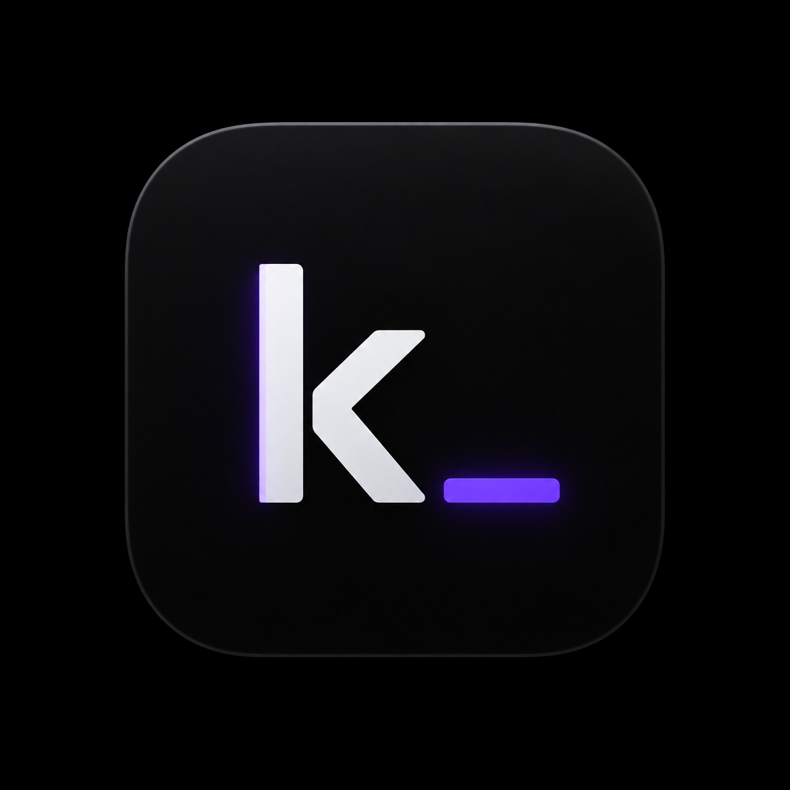

<p align="center">
  
</p>

<h1 align="center">kslop</h1>

kslop is a continuation and fork of Cyanide, which is itself a fork of
[`wh1te4ever/darksword-kexploit-fun`](https://github.com/wh1te4ever/darksword-kexploit-fun),
built on [`opa334/darksword-kexploit`](https://github.com/opa334/darksword-kexploit).
It preserves the original kernel read/write and RemoteCall foundation while
substantially reworking the application, tweak runner, recovery behavior, and
iOS 26 support.

Most development time has gone into rebuilding SnowBoard support as a persistent
IconServices-backed theme engine. Using this, we achieve complete coverage across Home
Screen icons, folders, App Library, notifications, the app switcher, Spotlight,
and launch/return transitions. Spotlight is the only slight hiccup currently requiring a 
manual reapply if the process restarts, which it does sometimes.

kslop also includes a system Font Changer adapted from Lara's font-replacement
approach, with local font importing, size validation, stock backups,
restoration, and Regular/Italic/Mono family support.

Development and integration: [`rooootdev`](https://github.com/rooootdev) /
[`zeroxjf`](https://github.com/zeroxjf). The upstream contributors and license
are credited below.

## Tweaks

These tweaks have been tested on iOS 18.x and 26.x. Expect version drift in
SpringBoard and related daemons to break things on other releases.

### Status Bar

- **StatBar**: battery temperature and free-RAM overlay anchored to the
  SpringBoard status bar, with optional C/F and network-speed display.
- **NSBar**: compact live download/upload speed overlay for the status bar,
  with selectable corner/center positions. Ported from
  [`d1y/cyanide-ios`](https://github.com/d1y/cyanide-ios).
- **NiceBar Lite**: configurable status-bar-adjacent labels for custom text,
  date/time formats, battery, memory, traffic, uptime, IP address, disk,
  thermal state, and other live readouts. Ported from
  [`d1y/cyanide-ios`](https://github.com/d1y/cyanide-ios).

### Home Screen Layout

- **SBCustomizer**: dock icon count, home-screen columns/rows, and hidden icon
  labels. Native port of the lightsaber sbcustomizer payload.
- **Home Layout Extras**: extra padding around the home grid and dock, plus
  per-icon scale for home and dock icons. Stacks on top of SBCustomizer.

### Performance

- **Powercuff**: CPU/GPU underclocking through simulated `thermalmonitord`
  pressure levels (off, nominal, light, moderate, heavy). Lasts until reboot.
  Port of [`rpetrich/Powercuff`](https://github.com/rpetrich/Powercuff).

### SpringBoard Tweaks

Ported from [`kolbicz/DarkSword-Tweaks`](https://github.com/kolbicz/DarkSword-Tweaks):

- **Disable App Library**: removes the App Library page past the last home screen.
- **Disable Icon Fly-In**: skips the spring-in animation when icons appear.
- **Zero Wake Animation**: snaps the display on instantly when waking.
- **Zero Backlight Fade**: instant lock/unlock backlight.
- **Double-Tap to Lock**: lock the device with a wallpaper double-tap.

### System Updates

- **Disable OTA Updates**: toggles the launchd OTA `disabled.plist` to block or
  unblock update prompts. Persists across reboots.

### Appearance

- **SnowBoard Remix**: imports SnowBoard/IconBundles themes and publishes
  persistent IconServices records through a pinned daemon session. It keeps
  original stock records in recovery journals for Apply and Restore; **Update
  Repair** handles newly installed or updated apps. SpringBoard cache refresh
  is still under investigation. The import UI began with the SnowBoard Lite
  port from [`d1y/cyanide-ios`](https://github.com/d1y/cyanide-ios), then was
  rebuilt by `rooootdev / zeroxjf`.
- **Font Changer**: imports local fonts, validates their size, and replaces the
  system Regular, Italic, and Mono families with stock backups and Restore.
  Adapted by `rooootdev / zeroxjf` from Lara's font-replacement approach.

### Beta

> ⚠︎ Work in progress — these work but may change or need re-applying between builds.

- **Gravity Lite**: core port of Julio Verne's classic Gravity tweak. Applies
  UIDynamicAnimator physics to home-screen and dock icons — gravity, collisions,
  bounce, friction, accelerometer steering, shake pulses, and an explosion
  button. Use Restore Icon Layout if icons stay displaced after deactivating.
- **Axon Lite**: groups Notification Center requests by app with a SpringBoard
  overlay and dedups duplicates while the RemoteCall session is alive.
- **Cyanide Themer**: per-bundle icon theme engine. Walks SpringBoard's
  SBIconView hierarchy and swaps each icon's image with a PNG matched on bundle
  ID. Ships with iOS 6 Theme; also accepts a custom folder of `<bundleID>.png`
  files or a binary plist. Pick a theme in Settings before running.
- **LiveWP**: copies a selected MP4/MOV/M4V into Cyanide's app container and
  plays it behind SpringBoard's home and lock screen windows while the live
  RemoteCall session is active. Ported from
  [`d1y/cyanide-ios`](https://github.com/d1y/cyanide-ios).
- **Watch Pairing Override**: edits the watchOS pairing range stored on the
  iPhone so you can pair a newer Apple Watch or revive an older one. Persists
  across reboots; respring before pairing.
- **Location Simulator**: drives Apple's CoreLocation simulation path from a
  RemoteCall host process and sets a static target coordinate. Simulated
  locations may violate app terms, platform rules, game rules, ride-share or
  delivery policies, or local law depending on how they are used. Use only where
  you have permission; you are responsible for your use and apply or restore it
  at your own risk. It may also affect location-tied system behavior such as
  time zone/date/time handling and can have unintended consequences; only use it
  if you know what you're doing. Credits: `kolbicz` provided the
  RemoteCall/CLSimulationManager GPS spoofer prototype, and `ezzuldinSt`'s
  LSpoof provided the app-side spoofing, picker, bookmarks, and route-simulation
  reference.
- **Call Recording Sound**: replaces the CallServices
  `StartDisclosureWithTone` and `StopDisclosure` audio files with Cyanide's
  bundled silent payloads, with separate Silence and Restore actions. Cyanide
  backs up the first originals into its app container before replacement, but
  this is still a persistent system-file edit under
  `/var/mobile/Library/CallServices/Greetings/default`. Disclosure sounds may be
  legally required where you live; you are responsible for your use and should
  restore the originals before removing Cyanide if you want Cyanide's backups
  written back. Credits: `YangJiiii` (`@duongduong0908`) for the EnsWilde and
  Disable Call Recording BookRestore reference tools, and `@Little_34306` as
  credited by the original projects for the Disable Call Recording concept.

### Experimental

> ⚠︎ Unstable or in-development — require Experimental Tweaks to be enabled in Settings.
>
> Experimental tweaks ship early to [Patreon supporters](https://www.patreon.com/zeroxjf) before public release.

- **Dynamic Stage Lite**: brings Stage Manager-style split-view to iPhone over
  RemoteCall — no jailbreak required. Hosts a second app's scene alongside
  SpringBoard using the same scene-hosting design as [`tomt000`'s Dynamic Stage](https://havoc.app/package/dynamicstage).
- **Signal Readouts**: replaces the signal-strength glyphs with live numeric
  readouts — RSRP dBm on cellular, bar count on WiFi.
- **TypeBanner**: shows a pill banner below the Dynamic Island when the active
  Messages conversation shows a typing indicator. Detection fires only while
  Messages.app is running.

## SnowBoard Remix and iOS 26 research

The [current research status](docs/research/README.md) and
[chronological handoff](docs/research/snowboard-remix-current-handoff.md)
record physical-device and VM evidence, plus the exact iOS 26.0 `23A341`,
`iPhone17,3` dyld-cache and disassembly work. Publication uses structured
`IFImage` objects, exact descriptors, one pinned daemon session, and recovery
journals. Restore and app-update rebasing have been verified. A persistent
index-token correction addresses unrelated app-install garbage collection;
its full physical reinstall audit is still pending. The bounded audits compare
UUIDs, store and pixel hashes, validation tokens, and LaunchServices source
identities, including the observed 27/28-point shared store unit.

The 3× per-app descriptor profile is 13×13 (appearance 0), 27×27 (0 and 1),
28×28 (0), 38×38 (0 and 1), 48×48 (0), 64×64 (0 for every app's Spotlight Apps
result), and 68×68 (0 and 1), plus 68×68 appearance 0 with
`variantOptions=0x20000`. Safari alone adds a 20×20 SnippetUI badge. Old
10-record journals safely add only the missing 64-point record.

The research covers Home, folders, App Library, notifications, switcher titles,
Spotlight, and launch/return transitions, with lab KRW, injected inspection
dylibs, RemoteCall tracing, local notification probes, app-install invalidation
tracing, and resident consumer inventories. Spotlight transparency and
Clock/Calendar source behavior remain active research areas. SpringBoard cache
invalidation is temporarily disabled; the one-second RemoteCall bootstrap wait
remains. Screen-recording invalidation was an isolated, unproven observation,
and failed Clock experiments are retained as negative evidence. Earlier handoff
notes are chronological and may contain stale validation TODOs.

## Supported Targets

Tested target range:

- iOS/iPadOS 17.0 through 18.7.1
- iOS/iPadOS 26.0 through 26.0.1
- A19/M5 devices are not supported

The kernel bugs used here, `CVE-2025-43510` and `CVE-2025-43520`, were fixed in
iOS/iPadOS 18.7.2 and 26.1. Later builds are outside this kernel exploit window.

## What This Fork Changes

- Cleans shared exploit state before each attempt.
- Matches the target process with an explicit marker.
- Validates sockets before using the spray path.
- Treats missed races as retryable failures instead of hard failures.
- Tightens the A18/M4 `pe_v2` path with initialized target-file contents,
  stable local remap addresses, bounded page freeing, socket-spray preflight
  checks, and controlled zone-trim retries.

## Kernel Research Features

- Escape the app sandbox.
- Control or crash userspace processes from the app.
- Change UID, GID, and sticky bits on target files.
- Disable ASLR by setting `P_DISABLE_ASLR` in `launchd`'s `proc->p_flag`.

## Credits

- Lara: font-replacement approach adapted for kslop Font Changer.
- [`opa334`](https://github.com/opa334): original [`darksword-kexploit`](https://github.com/opa334/darksword-kexploit), ChOma, and XPF — the kernel r/w primitive Cyanide is built on.
- [`wh1te4ever`](https://github.com/wh1te4ever): [`kfun` / `darksword-kexploit-fun`](https://github.com/wh1te4ever/darksword-kexploit-fun) — the RemoteCall implementation that lets a sideloaded app apply tweaks inside SpringBoard. Cyanide is a fork of this project.
- [`rooootdev`](https://github.com/rooootdev) / [`zeroxjf`](https://github.com/zeroxjf): kslop development, SnowBoard Remix integration, iOS 26 research, and working kexploit behavior used to stabilize this fork.
- [`neonmodder123`](https://github.com/neonmodder123): Web Respring method.
- [`kolbicz`](https://github.com/kolbicz): OTA Disabler, SpringBoard tweaks, and
  the RemoteCall/CLSimulationManager GPS spoofer prototype used as the starting
  point for Location Simulator.
- `ezzuldinSt`: LSpoof app-side `CLLocationManager` spoofing, picker,
  bookmarks, and route-simulation reference used while shaping Location
  Simulator.
- `YangJiiii` (`@duongduong0908`): EnsWilde and Disable Call Recording
  BookRestore reference tools used while shaping Call Recording Sound.
- `@Little_34306`: credited by the original call-recording projects for the
  Disable Call Recording concept.
- [`rpetrich`](https://github.com/rpetrich): Powercuff.
- [Julio Verne](https://github.com/julioverne): the original [Gravity](https://github.com/julioverne/Gravity) tweak that Gravity Lite is a core port of.
- [`d1y`](https://x.com/chenhonzhou): [`cyanide-ios`](https://github.com/d1y/cyanide-ios)
  AGPL-3.0 sources used for the NSBar, NiceBar Lite, original SnowBoard Lite
  import UI, and LiveWP ports.
- [`tomt000`](https://github.com/tomt000): [Dynamic Stage](https://havoc.app/package/dynamicstage) — the original Stage Manager-for-iPhone tweak whose split-view + scene-hosting design Dynamic Stage Lite re-implements over RemoteCall.

### UI inspiration

- The classic [Installer.app](https://github.com/AppTapp/Installer-3) (Ripdev & Nullriver Software, now maintained by AppTapp and the Legacy Jailbreak community) — the iPhoneOS 1 package-manager look that the Cyanide Installer tab is modeled after.
- The [Sileo Project](https://github.com/Sileo/Sileo) (the Sileo Team) — the queue → review → confirm install flow and the bottom queue-popup pattern.

## Build

```sh
./scripts/build.sh
```

The build script keeps the compatible `Cyanide` scheme and executable name,
disables code signing, and writes a versioned unsigned IPA plus a latest-build
symlink:

```text
build/Cyanide.ipa
```

Equivalent manual build:

```sh
xcodebuild \
  -project Cyanide.xcodeproj \
  -scheme Cyanide \
  -sdk iphoneos \
  -configuration Debug \
  CODE_SIGNING_ALLOWED=NO \
  build
```

## License

The open-source portion of this repository — everything outside the
`Cyanide/tweaks/private/` submodule — is licensed under **AGPL-3.0**.
See `LICENSE`.

The NSBar, NiceBar Lite, original SnowBoard Lite import UI, and LiveWP ports
adapt AGPL-3.0 code from
[`d1y/cyanide-ios`](https://github.com/d1y/cyanide-ios) and remain in the
AGPL-covered public tree.

The `Cyanide/tweaks/private/` submodule points at a separate private
repository containing closed-source tweak implementations. Those files are
**All Rights Reserved** and distributed in compiled form only inside official
Cyanide releases. Experimental entries from that submodule are gated to active
Patreon supporters at the Member tier or above. Public clones won't be able to
fetch the submodule, and private-submodule tweaks will be absent from local
builds unless you re-implement them. Public Beta features, including Location
Simulator and Call Recording Sound, build from the open-source tree. The public
app target still builds without that submodule.
